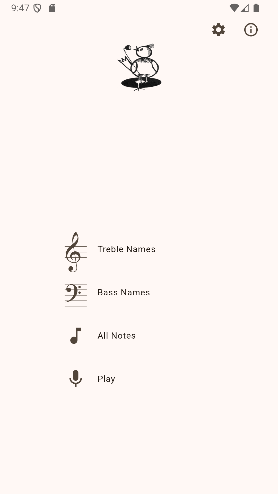
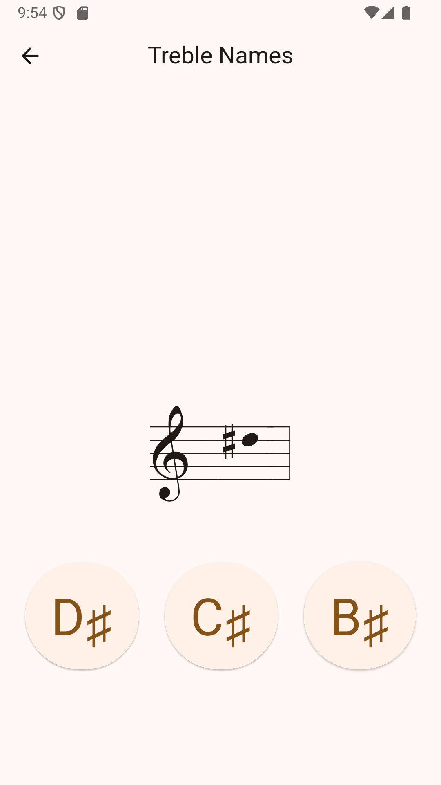
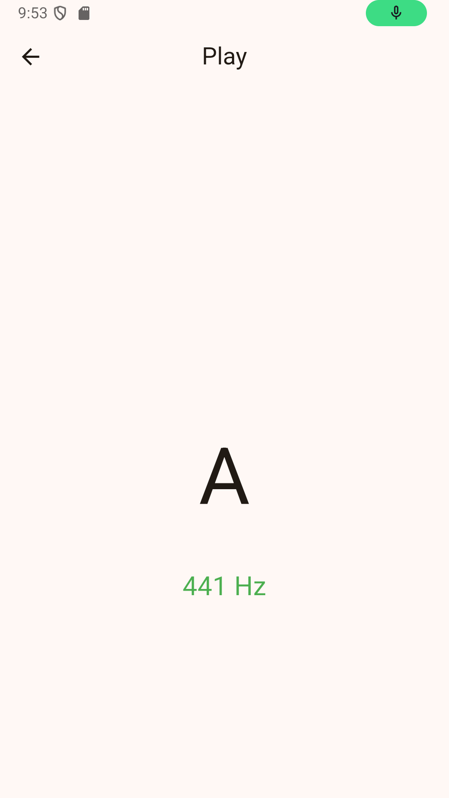
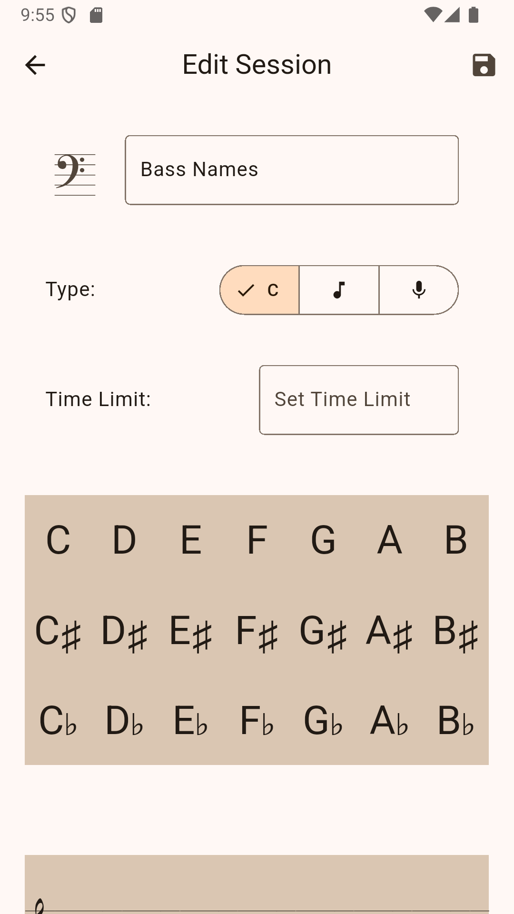

# Helma's Note Trainer

Helma's Note Trainer is an application to practice the names of music notes.
It provides exercises to train the name of notes on the staff and detects the
pitch of your instrument to practice playing notes by name.

- Note Name Practice: Tap the correct name for a given note on the staff, or tap the correct note
  for a given name.
- Note Playing Practice: Play the correct pitch on your instrument for a given note name.
- Customizable Sessions: Tailor practice sessions to focus on specific clefs, ranges, or
  accidentals.
- Timer Mode: Add an extra challenge to your practice.
- Progress Stats: Track your training progress and accuracy.
- Share your practice sessions with others.
- Supports note names in English, German, and Dutch.

See it in action at https://csigg.com/notes/.

# Manual

### Getting Started

**What is the Note Trainer App?** The Note Trainer App provides interactive exercises to help you
recognize musical notes on the staff and their corresponding names. You can create custom practice
sessions tailored to your specific learning needs.

**Basic Navigation**: The app primarily uses a list of practice sessions as its main screen. Click
on the gear icon at the top right to add/remove or edit sessions. Tap on a session in the list to
start practicing.

### Practice Sessions

**Understanding Session Types**: The app offers different types of practice to target specific
skills:

    - **Names**: You are shown a musical note on the staff and must identify the corresponding name
      of the note.
    - **Notes**: You are shown the name of a note and must identify the corresponding musical note
      on the staff.
    - **Play**: You are shown the name of a note and must play the correct pitch on your instrument.

**Starting a Practice Session**: Simply tap on the desired session in the main session list.

**During a Practice Session**: You will be presented with a note/key prompt.

    - Respond by pressing button with the correct key or note below.
    - If the answer is wrong, the button will turn red. If it's correct, the button will turn green
      and shortly after a new note/key will be shown.
    - For play session type, play the note on your instrument. The app will detect the pitch and
      provide feedback whether the pitch is too low, too high, or correct. The first note of a play
      session is always an A which is used to detect the tuning of you instrument.
    - Optionally, a timer will be shown at the top right. When it runs out, a new note/key will be
      shown.

**Viewing Practice Stats**: On the main session list, basic statistics for each session are
shown on the left.

    - Number of practiced tests.
    - The rate of correct answers.
    - Total practice time.

### Edit Sessions

Tap the "gear" icon in the top right to manage your sessions. Here, you can select the language for
note names at the bottom. Use the green "plus" icon to add a new session, the red "trash" icon to
remove one, or the "pencil" icon to edit an existing session. Press the "check" icon at the top to
stop managing sessions.

**Understanding the Session Editor**

    - You can choose the title and icon for your session, change the type and add a per-question
      time limit.
    - Select the set of note names and notes on the staff that will be displayed during practice.
    - Tap individual notes to select or deselect them. Tap the clefs to select or deselect the
      entire row.

**Sharing Sessions (via a link)**

    - Tap the "share" icon at the top of the session editor. A sharable link encoding the session
      configuration will be copied to your device's clipboard.
    - Paste this link into a message, email, or other communication method to share it with others.
    - Opening the link on your receiver's device should open the app and automatically add the
      session that is encoded in the link to the list.

### Installation

This web site is a progressive web app (PWA) which can be downloaded to your device and used like an
app. The procedure to do that depends on your device.

    - **Android**: 'Press the "three dots" icon at the top right, select "Add to Home screen" from 
      the menu and press "Add".
    - **iOS**: Press the "Share" button at the bottom, select "Add to Home Screen" from the menu and
      press "Add".

### Privacy Policy

The app is provided free of charge without ads and doesn't collect any personal information or any
other data.

# Build instructions

`flutter build web --release --base-href=/notes/`

# Screenshots

  
  
  
  

